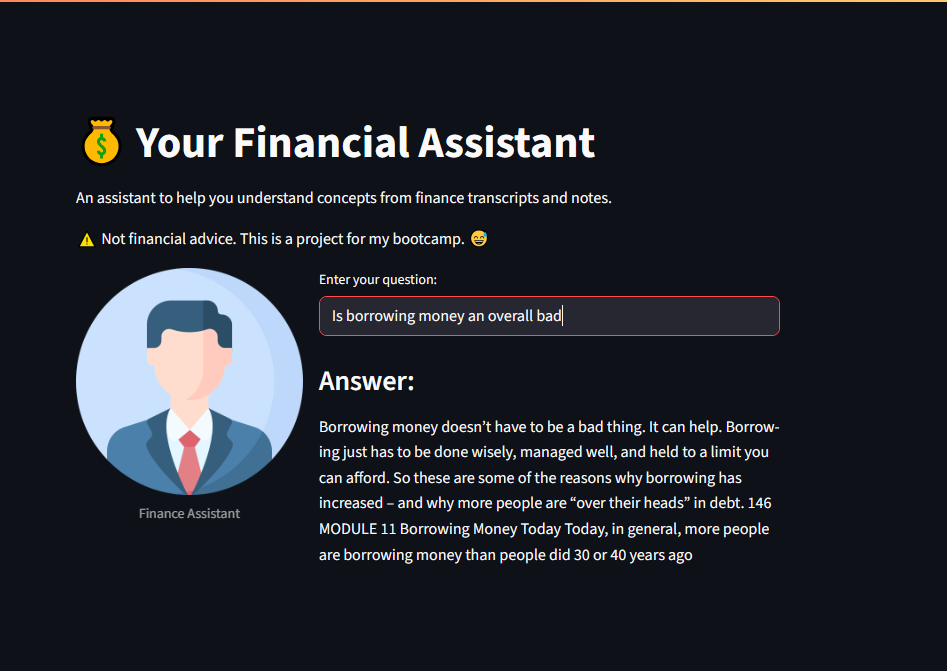
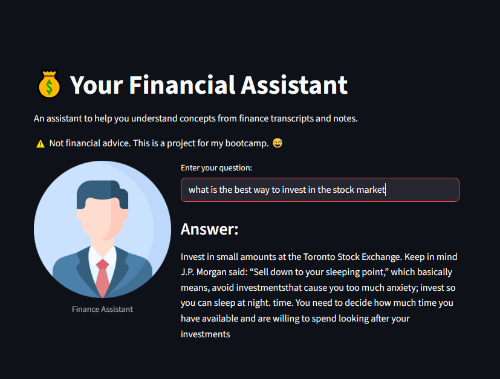
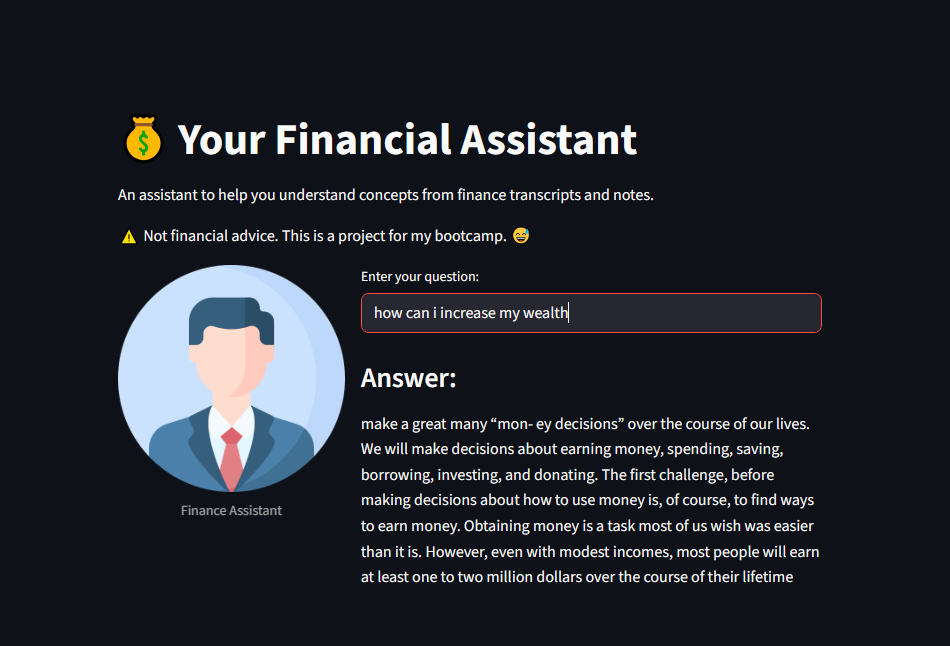

# 💰 Finance Q&A Assistant  

This project is an interactive assistant that helps users explore finance concepts by asking natural language questions. The system searches through a collection of finance-related transcripts and documents, then generates clear, concise answers powered by a local AI model.  

---

## 🛠️ Tech Stack  

- **[Streamlit](https://streamlit.io/)** → for a simple and responsive web UI  
- **[LangChain](https://www.langchain.com/)** → for chaining prompts and responses  
- **[Hugging Face Transformers](https://huggingface.co/)** → using `google/flan-t5-small` locally for text generation  
- **[FAISS](https://github.com/facebookresearch/faiss)** → efficient document similarity search  
- **Python 3.9+**

---

## ⚙️ How to Run  

1. **Clone the repo**  
   ```bash
   git clone https://github.com/your-username/finance-qa-assistant.git
   cd finance-qa-assistant
2. **Set up a virtual environment**
python -m venv venv
source venv/bin/activate   # Mac/Linux
venv\Scripts\activate      # Windows
**3. Install required libraries**
pip install -r requirements.txt
**4. Prepare your dataset**
Place finance-related .txt and .pdf files in a folder called data/.
Example:
data/
├── finance_notes.txt
├── investments.txt
├── risk_management.txt
├── finance_pdf1.pdf
└── finance_pdf2.pdf
**5. Build the vector index**
python src/retrieve.py
**6. Launch the app**
streamlit run src/app.py


💡 Example Interactions

Here are some screenshots of sample questions and answers:

Example 1:



Example 2:


Example 3:


## Live link

https://rag-financies.streamlit.app/
